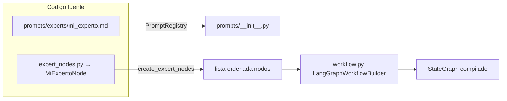

# Agregar un Nuevo Experto

## Checklist

- [ ] Crear archivo de prompt en `src/agent/src/code_analysis/prompts/experts/`
- [ ] Registrar el experto en `PromptRegistry` (`prompts/__init__.py`: `expert_files` + `list_experts`)
- [ ] Crear clase de nodo en `src/agent/src/code_analysis/infra/adapters/langgraph/nodes/expert_nodes.py`
- [ ] Registrar la instancia en `create_expert_nodes()` **y** entrada en **`EXPERT_CLASSES`** (solo el dict hoy sirve como registro opcional para inspección; el grafo usa la lista factory)
- [ ] Actualizar `docs/architecture.md` (filtros tabla)
- [ ] Tests unitarios bajo `src/agent/tests/unit/`

## Paso 1: Crear prompt

```bash
cat > src/agent/src/code_analysis/prompts/experts/mi_experto.md << 'EOF'
You are the **Mi Experto** security expert. Your domain: [descripción].

## What to Look For
- Pattern 1
- Pattern 2

## Severity Guidelines
**CRITICAL**: ...
**HIGH**: ...
**MEDIUM**: ...

## Output Format
Return ONLY valid JSON:
```json
{"issues": []}
```

Write all descriptions in **neutral Spanish**.
EOF
```

## Paso 2: Registrar en PromptRegistry

Editar `prompts/__init__.py`:

```python
expert_files = {
    # ... existentes ...
    "mi_experto": "experts/mi_experto.md",  # <- NUEVO
}

def list_experts(self) -> list[str]:
    return [
        # ... existentes ...
        "mi_experto",  # <- NUEVO
    ]
```

## Paso 3: Crear nodo experto

Editar `src/agent/src/code_analysis/infra/adapters/langgraph/nodes/expert_nodes.py`:

```python
class MiExpertoNode(BaseExpertNode):
    """Expert node for [descripción]."""

    @property
    def expert_name(self) -> str:
        return "mi_experto"

    def get_file_patterns(self) -> list[str]:
        """Archivos relevantes para este experto."""
        return [
            "*.ext",      # Extensión específica
            "*pattern*",  # Patrón en nombre
        ]
        # Return [] para analizar todos los archivos
```

## Paso 4: Registrar en factory y diccionario

En el mismo archivo `expert_nodes.py`:

1. Añadir la clase a **`EXPERT_CLASSES`** (`"mi_experto": MiExpertoNode`), por consistencia.
2. Añadir **`MiExpertoNode(model)`** en la lista devuelta por **`create_expert_nodes`** en el orden deseado (el orden define la ejecución en el grafo).

## Paso 5: Rebuild y deploy

```bash
docker build -f src/agent/Dockerfile -t titvo-agent:latest src/agent
```

## Diagrama de integración



(Prefijo `src/agent/src/code_analysis/` delante de `prompts/` e `infra/...`.)

## Testing

Creá `src/agent/tests/unit/test_mi_experto.py` siguiendo el estilo existente (`test_expert_nodes.py`) y ejecutá:

```bash
cd src/agent
.venv/bin/python -m pytest tests/unit/test_mi_experto.py -q
```

Ejemplo mínimo:

```python
import pytest
from code_analysis.infra.adapters.langgraph.nodes.expert_nodes import MiExpertoNode

def test_expert_name():
    node = MiExpertoNode(None)
    assert node.expert_name == "mi_experto"
```
