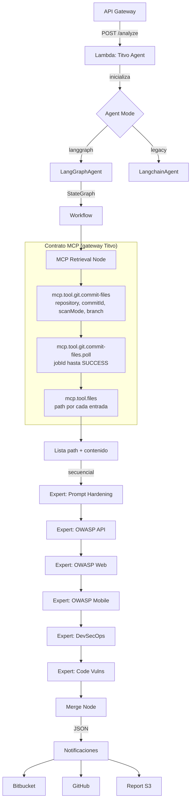
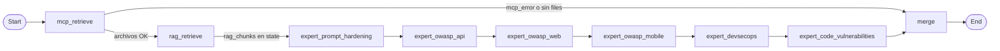
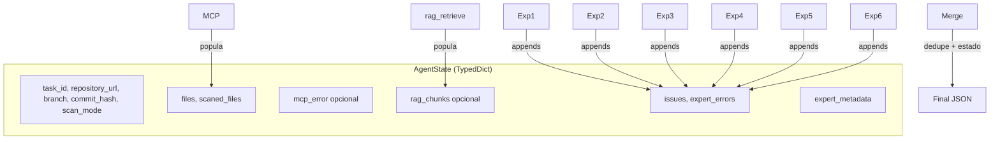

# Arquitectura del Agente

## Vista General



## LangGraph Workflow



## Rol activo del índice RAG durante el análisis

Después de que `mcp_retrieve` obtiene los archivos seleccionados para el análisis, el nodo `rag_retrieve` descarga
`latest/index.db` desde S3 (generado por el rag-indexer) y ejecuta una búsqueda vectorial por cada
archivo seleccionado. Los chunks semánticamente relacionados del codebase completo de la rama se
almacenan en `state.rag_chunks`.

Cada nodo experto recibe los `rag_chunks` y los filtra por sus patrones de archivo (`should_analyze_file`).
Los chunks filtrados se incluyen en el human message al LLM como bloque `=== RAG CONTEXT ===`.

En modo `commit`, el pre-scan mantiene el comportamiento de verificar que exista un índice de rama.
En modo `full`, el pre-scan prioriza exactitud: valida que el índice RAG esté fresco para el
`commit_hash` objetivo y espera indexación si está stale antes de ejecutar LangGraph.

Si el índice no está disponible o cualquier operación de búsqueda falla durante `rag_retrieve`,
`rag_chunks` se inicializa en `[]` y el análisis continúa con solo los archivos seleccionados vía MCP
(degradación graceful).

## Flujo de Datos (State)



## Componentes Principales

| Componente | Archivo | Responsabilidad |
|------------|---------|-----------------|
| LangGraphAgent | `infra/adapters/langgraph_agent.py` | Implementa AbstractAgent con workflow LangGraph |
| Workflow Builder | `infra/adapters/langgraph/workflow.py` | Construye StateGraph con nodos |
| MCP Node | `infra/adapters/langgraph/nodes/mcp_retrieval_node.py` | Invoke + polling MCP (`commit-files`, `commit-files.poll`, `files`), parámetros `repository`/`commitId`/`scanMode`/`branch`/`path` |
| RAG Retrieval Node | `infra/adapters/langgraph/nodes/rag_retrieval_node.py` | Descarga `index.db` de S3 y busca chunks por cada archivo seleccionado; almacena en `rag_chunks` |
| RAG Context Port | `domain/ports/rag_context_port.py` | Puerto hexagonal `IRagContextPort` con `configure()`, `search()` y `close()` |
| RAG Context Adapter | `infra/adapters/s3_sqlite_rag_context_adapter.py` | Descarga S3 + búsqueda sqlite-vec; degradación graceful ante errores |
| Expert Nodes | `infra/adapters/langgraph/nodes/expert_nodes.py` | Seis expertos con filtros de archivo; cada uno filtra `rag_chunks` por `should_analyze_file()` |
| Merge Node | `infra/adapters/langgraph/nodes/merge_findings_node.py` | Dedup por clave (`get_dedup_key`), estado FAILED/WARNING/COMPLETED |
| FindingsMerger | `domain/services/findings_merger.py` | Política en dominio: severidad menor ante conflictos mismos `(path,line,category)` |
| PromptRegistry | `prompts/__init__.py` | Carga prompts embebidos |

## Contrato MCP (gateway Titvo)

Las tools **no están descritas de nuevo aquí**, pero el agente debe respetar el flujo asíncrono:

1. `mcp.tool.git.commit-files` con `scanMode=commit` (default) o `scanMode=full` + `branch` → respuesta `jobId` (+ `pollToolName`).
2. `mcp.tool.git.commit-files.poll` con `jobId` hasta `SUCCESS`/`FAILURE` → lista `filesPaths` y metadatos `scanMode`, `scanRef`, `storagePrefix` cuando aplican.
3. `mcp.tool.files` con **`path`** por cada elemento.

En `commit`, el worker mantiene keys S3 `{commitId}/{filePath}`. En `full`, el worker usa un prefijo
aislado por job (`full/{jobId}/...`) y el agente normaliza esos paths antes de entregarlos a expertos.

Legacy: el modelo puede orquestarlo en varios turnos. LangGraph: lo hace código en `MCPRetrievalNode` (sin LLM para esa parte).

| Experto | Patrones | Fallback |
|---------|----------|----------|
| prompt_hardening | Todos | - |
| owasp_api | rutas/handlers/controllers, openapi/swagger, patrones nombre | Todos si vacío |
| owasp_web | `*.html`, `*.tsx`, `*template*`, `*.js`/`.jsx`/`.vue`, etc. | Todos si vacío |
| owasp_mobile | `AndroidManifest.xml`, `network_security_config.xml`, `*.kt`, `*.swift`, `Info.plist`, `*.entitlements`, `pubspec.yaml`, `*.dart`, `app.json`, `*.tsx`/`.jsx`, etc. | Todos si vacío |
| devsecops | `*.yml`, `Dockerfile*`, `*.tf`, `.github/**` | Todos si vacío |
| code_vulnerabilities | Todos | - |

## Modos de agente (`TITVO_AGENT_MODE`)

### LangGraph (default)

Default si no defines la variable (`main.py` usa `langgraph`).

```bash
export TITVO_AGENT_MODE=langgraph
```

- MCP en código determinístico (menos tokens en fase MCP).
- Seis expertos secuenciales y nodo **`merge`**.
- Tracing Langfuse vía **`langfuse.langchain.CallbackHandler`**.

### Legacy

```bash
export TITVO_AGENT_MODE=legacy
```

- Un solo **`create_agent`** con todas las tools MCP; el modelo decide la secuencia por turnos.
- Útil para rollback o diagnóstico comparativo.

## Paths en componentes de la tabla

Los archivos están bajo `src/agent/src/code_analysis/` (prefijo omitido arriba en paths relativos típicos a `infra/...`).
