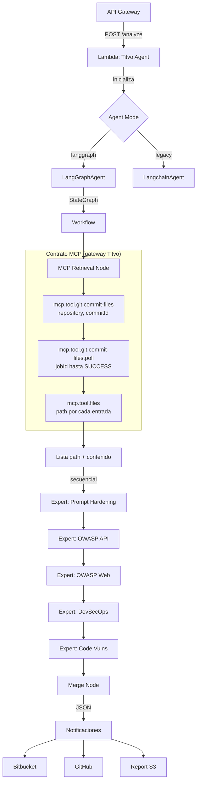
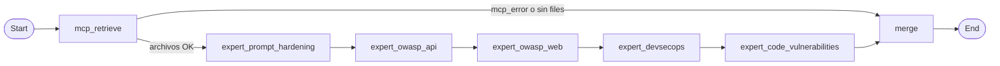
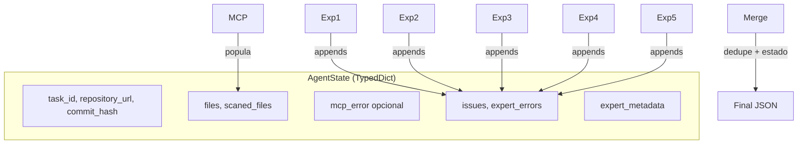

# Arquitectura del Agente

## Vista General



## LangGraph Workflow



## Flujo de Datos (State)



## Componentes Principales

| Componente | Archivo | Responsabilidad |
|------------|---------|-----------------|
| LangGraphAgent | `infra/adapters/langgraph_agent.py` | Implementa AbstractAgent con workflow LangGraph |
| Workflow Builder | `infra/adapters/langgraph/workflow.py` | Construye StateGraph con nodos |
| MCP Node | `infra/adapters/langgraph/nodes/mcp_retrieval_node.py` | Invoke + polling MCP (`commit-files`, `commit-files.poll`, `files`), parámetros `repository`/`commitId`/`path` |
| Expert Nodes | `infra/adapters/langgraph/nodes/expert_nodes.py` | Cinco expertos con filtros de archivo |
| Merge Node | `infra/adapters/langgraph/nodes/merge_findings_node.py` | Dedup por clave (`get_dedup_key`), estado FAILED/WARNING/COMPLETED |
| FindingsMerger | `domain/services/findings_merger.py` | Política en dominio: severidad menor ante conflictos mismos `(path,line,category)`; el grafo puede evolucionar a reutilizarlo plenamente en `merge` |
| PromptRegistry | `prompts/__init__.py` | Carga prompts embebidos |

## Contrato MCP (gateway Titvo)

Las tools **no están descritas de nuevo aquí**, pero el agente debe respetar el flujo asíncrono:

1. `mcp.tool.git.commit-files` → respuesta `jobId` (+ `pollToolName`).
2. `mcp.tool.git.commit-files.poll` con `jobId` hasta `SUCCESS`/`FAILURE` → lista `filesPaths`.
3. `mcp.tool.files` con **`path`** por cada elemento.

Legacy: el modelo puede orquestarlo en varios turnos. LangGraph: lo hace código en `MCPRetrievalNode` (sin LLM para esa parte).

| Experto | Patrones | Fallback |
|---------|----------|----------|
| prompt_hardening | Todos | - |
| owasp_api | rutas/handlers/controllers, openapi/swagger, patrones nombre | Todos si vacío |
| owasp_web | `*.html`, `*.tsx`, `*template*`, `*.js`/`.jsx`/`.vue`, etc. | Todos si vacío |
| devsecops | `*.yml`, `Dockerfile*`, `*.tf`, `.github/**` | Todos si vacío |
| code_vulnerabilities | Todos | - |

## Modos de agente (`TITVO_AGENT_MODE`)

### LangGraph (default)

Default si no defines la variable (`main.py` usa `langgraph`).

```bash
export TITVO_AGENT_MODE=langgraph
```

- MCP en código determinístico (menos tokens en fase MCP).
- Cinco expertos secuenciales y nodo **`merge`**.
- Tracing Langfuse vía **`langfuse.langchain.CallbackHandler`**.

### Legacy

```bash
export TITVO_AGENT_MODE=legacy
```

- Un solo **`create_agent`** con todas las tools MCP; el modelo decide la secuencia por turnos.
- Útil para rollback o diagnóstico comparativo.

## Paths en componentes de la tabla

Los archivos están bajo `src/agent/src/code_analysis/` (prefijo omitido arriba en paths relativos típicos a `infra/...`).
