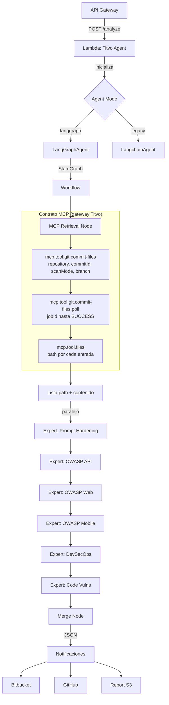
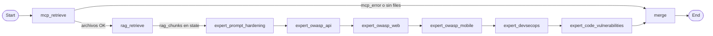
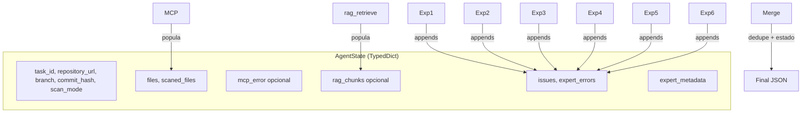
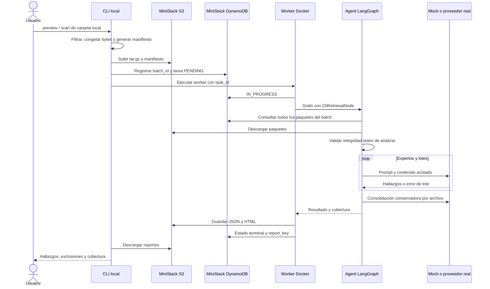
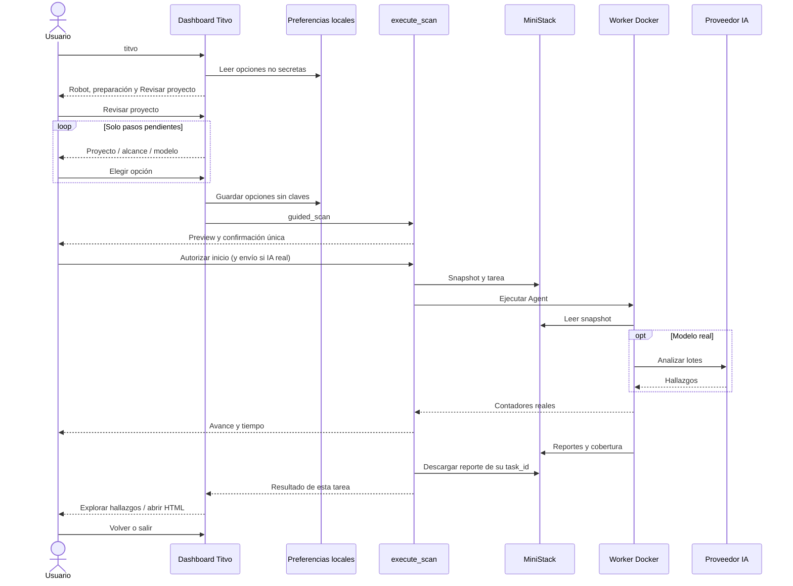
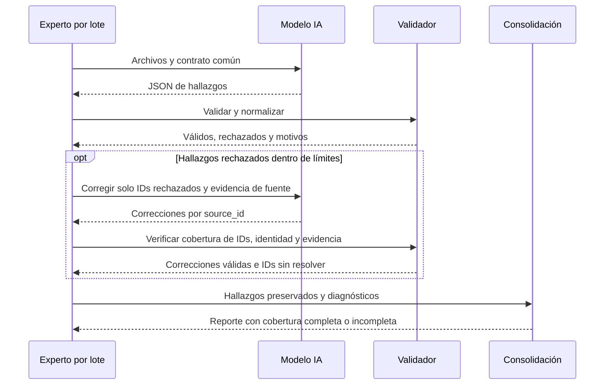
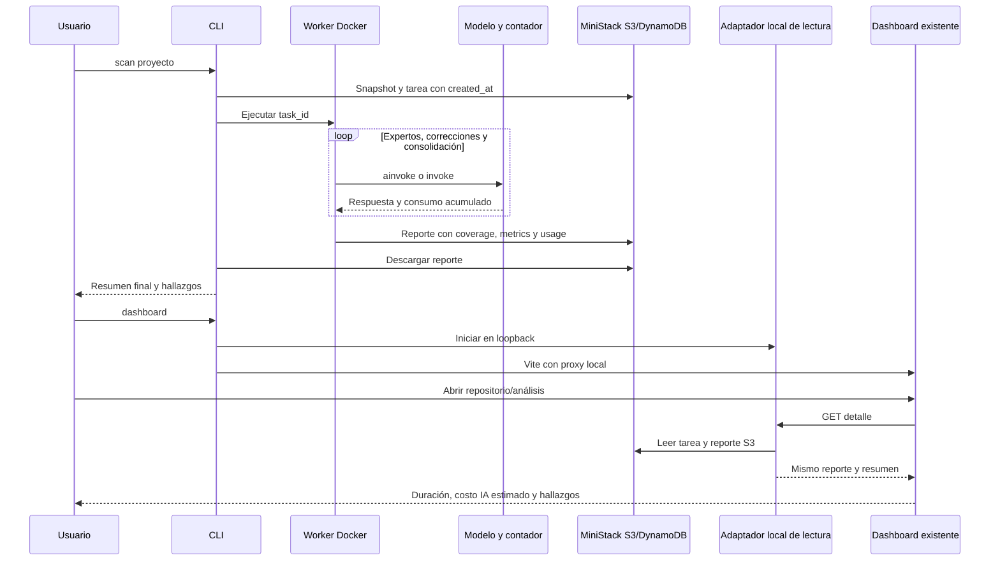
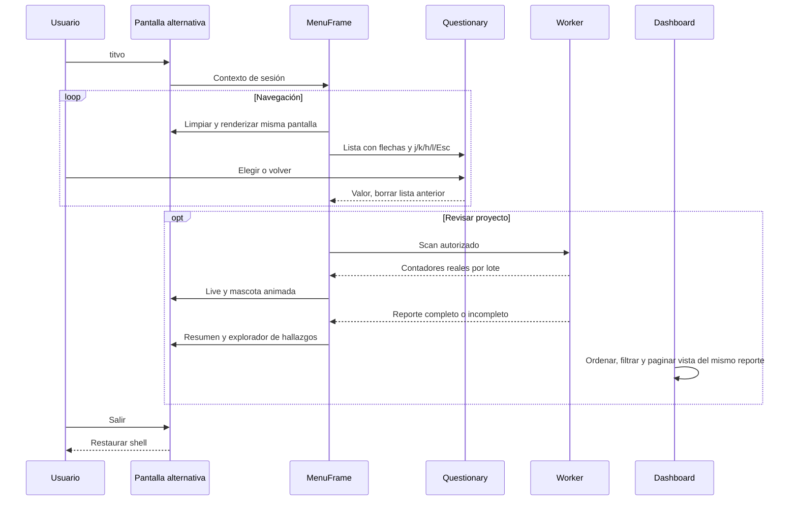
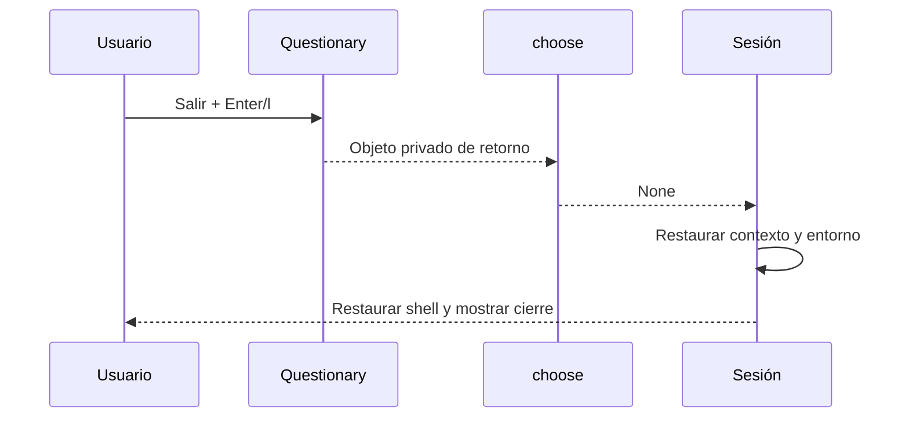
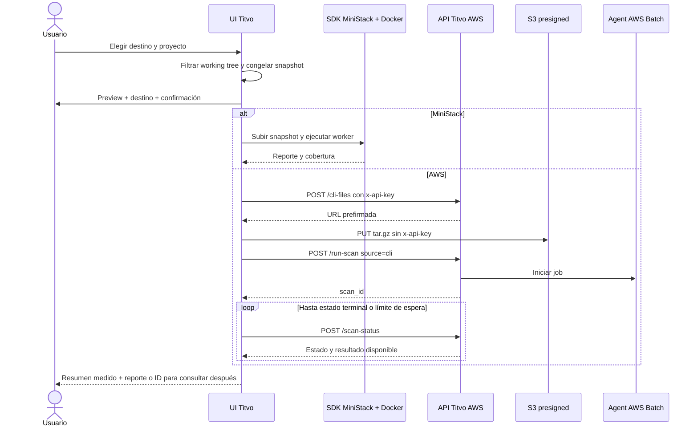

# Arquitectura del Agente

## Vista General


```mermaid
flowchart TD
    API[API Gateway] -->|POST /analyze| Lambda[Lambda: Titvo Agent]
    Lambda -->|inicializa| Agent{Agent Mode}
    Agent -->|langgraph| LGA[LangGraphAgent]
    Agent -->|legacy| LCA[LangchainAgent]
    
    LGA -->|StateGraph| WF[Workflow]
    WF --> MCP[MCP Retrieval Node]
    subgraph MCP_Fases["Contrato MCP (gateway Titvo)"]
        MCP --> A[mcp.tool.git.commit-files<br/>repository, commitId, scanMode, branch]
        A --> B[mcp.tool.git.commit-files.poll<br/>jobId hasta SUCCESS]
        B --> C[mcp.tool.files<br/>path por cada entrada]
    end
    C --> Files[Lista path + contenido]

    Files -->|paralelo| Exp1[Expert: Prompt Hardening]
    Exp1 --> Exp2[Expert: OWASP API]
    Exp2 --> Exp3[Expert: OWASP Web]
    Exp3 --> Exp4[Expert: OWASP Mobile]
    Exp4 --> Exp5[Expert: DevSecOps]
    Exp5 --> Exp6[Expert: Code Vulns]
    Exp6 --> Merge[Merge Node]
    
    Merge -->|JSON| Notify[Notificaciones]
    Notify --> Bit[Bitbucket]
    Notify --> GitHub[GitHub]
    Notify --> S3[Report S3]
```

## LangGraph Workflow


```mermaid
flowchart LR
    Start([Start]) --> MCP[mcp_retrieve]
    MCP -->|archivos OK| RAG[rag_retrieve]
    MCP -->|mcp_error o sin files| MG[merge]

    RAG -->|rag_chunks en state| EH[expert_prompt_hardening]

    EH --> EAPI[expert_owasp_api]
    EAPI --> EWEB[expert_owasp_web]
    EWEB --> EMOB[expert_owasp_mobile]
    EMOB --> EDO[expert_devsecops]
    EDO --> ECV[expert_code_vulnerabilities]
    ECV --> MG
    
    MG --> END([End])
```

## Rol activo del índice RAG durante el análisis

Después de que `mcp_retrieve` obtiene los archivos seleccionados para el análisis, el nodo `rag_retrieve` descarga
`latest/index.db` desde S3 (generado por el rag-indexer) y ejecuta una búsqueda vectorial por cada
archivo seleccionado. Los chunks semánticamente relacionados del codebase completo de la rama se
almacenan en `state.rag_chunks`.

Cada nodo experto recibe los `rag_chunks` y los filtra por sus patrones de archivo (`should_analyze_file`).
Los chunks filtrados se incluyen en el human message al LLM como bloque `=== RAG CONTEXT ===`.

En modo `commit`, el pre-scan mantiene el comportamiento de verificar que exista un índice de rama.
En modo `full`, el pre-scan prioriza exactitud: valida que el índice RAG esté fresco para el
`commit_hash` objetivo y espera indexación si está stale antes de ejecutar LangGraph.

### Resiliencia del rag-indexer (change `add-rag-indexer-resume-checkpointing`)

El rag-indexer now puede reanudar runs interrumpidos y coordinar accesos concurrentes:

```
run_fresh:
  acquire_lock(repo, branch) → True
  download_checkpoint → None
  download_source_snapshot → None
  get_files(exclude_paths={})  # git fetch + cat-file blob × N
  upload_source_snapshot      # solo primera vez
  for each file:
    iter_chunks → embed_iter → insert_one → mark_file_indexed
    if every_n_files: upload_checkpoint
  upload_db
  delete_checkpoint + delete_source_snapshot + release_lock

run_resume:
  acquire_lock(repo, branch) → True
  download_checkpoint → path
  download_source_snapshot → path
  restore_from_snapshot      # skip git fetch
  get_files(exclude_paths=indexed_files)
  continue process from last checkpoint
  upload_db
  cleanup
```

Para concurrencia: el `src/agent` DEBE leer `locks/{branch}.json` antes de gatillar un nuevo job. Si hay un lock activo, esperar al job existente (poll `lock.aws_batch_job_id`) en lugar de disparar uno nuevo. Ver `docs/rag-indexer.md` para detalles.
`rag_chunks` se inicializa en `[]` y el análisis continúa con solo los archivos seleccionados vía MCP
(degradación graceful).

## Flujo de Datos (State)


```mermaid
flowchart TD
    subgraph State["AgentState (TypedDict)"]
        Task[task_id, repository_url, branch, commit_hash, scan_mode]
        Files[files, scaned_files]
        MCPERR[mcp_error opcional]
        RAGChunks[rag_chunks opcional]
        Issues[issues, expert_errors]
        Meta[expert_metadata]
    end
    
    MCP -->|popula| Files
    RAG_Node[rag_retrieve] -->|popula| RAGChunks
    Exp1 -->|appends| Issues
    Exp2 -->|appends| Issues
    Exp3 -->|appends| Issues
    Exp4 -->|appends| Issues
    Exp5 -->|appends| Issues
    Exp6 -->|appends| Issues
    Merge -->|dedupe + estado| Final[Final JSON]
```

## Componentes Principales

| Componente | Archivo | Responsabilidad |
|------------|---------|-----------------|
| LangGraphAgent | `infra/adapters/langgraph_agent.py` | Implementa AbstractAgent con workflow LangGraph |
| Workflow Builder | `infra/adapters/langgraph/workflow.py` | Construye StateGraph con nodos |
| MCP Node | `infra/adapters/langgraph/nodes/mcp_retrieval_node.py` | Invoke + polling MCP (`commit-files`, `commit-files.poll`, `files`), parámetros `repository`/`commitId`/`scanMode`/`branch`/`path` |
| RAG Retrieval Node | `infra/adapters/langgraph/nodes/rag_retrieval_node.py` | Descarga `index.db` de S3 y busca chunks por cada archivo seleccionado; almacena en `rag_chunks` |
| RAG Context Port | `domain/ports/rag_context_port.py` | Puerto hexagonal `IRagContextPort` con `configure()`, `search()` y `close()` |
| RAG Context Adapter | `infra/adapters/s3_sqlite_rag_context_adapter.py` | Descarga S3 + búsqueda sqlite-vec; degradación graceful ante errores |
| Expert Nodes | `infra/adapters/langgraph/nodes/expert_nodes.py` | Seis expertos con filtros de archivo; cada uno filtra `rag_chunks` por `should_analyze_file()` |
| Merge Node | `infra/adapters/langgraph/nodes/merge_findings_node.py` | Dedup por clave (`get_dedup_key`), estado FAILED/WARNING/COMPLETED |
| FindingsMerger | `domain/services/findings_merger.py` | Política en dominio: severidad menor ante conflictos mismos `(path,line,category)` |
| PromptRegistry | `prompts/__init__.py` | Carga prompts embebidos |

## Contrato MCP (gateway Titvo)

Las tools **no están descritas de nuevo aquí**, pero el agente debe respetar el flujo asíncrono:

1. `mcp.tool.git.commit-files` con `scanMode=commit` (default) o `scanMode=full` + `branch` → respuesta `jobId` (+ `pollToolName`).
2. `mcp.tool.git.commit-files.poll` con `jobId` hasta `SUCCESS`/`FAILURE` → lista `filesPaths` y metadatos `scanMode`, `scanRef`, `storagePrefix` cuando aplican.
3. `mcp.tool.files` con **`path`** por cada elemento.

En `commit`, el worker mantiene keys S3 `{commitId}/{filePath}`. En `full`, el worker usa un prefijo
aislado por job (`full/{jobId}/...`) y el agente normaliza esos paths antes de entregarlos a expertos.

Legacy: el modelo puede orquestarlo en varios turnos. LangGraph: lo hace código en `MCPRetrievalNode` (sin LLM para esa parte).

### Acceso SSH a repositorios

`git-commit-files` accede a GitHub y Bitbucket exclusivamente mediante comandos Git sobre SSH. El worker
acepta las URLs HTTPS o SSH existentes, valida que el host sea exactamente `github.com` o
`bitbucket.org` y construye un remoto SSH canónico. El host selecciona internamente el parámetro cifrado
`github_ssh_private_key` o `bitbucket_ssh_private_key`; el contrato MCP no permite enviar llaves ni nombres
de parámetros.

Cada mensaje SQS obtiene una instancia aislada del cliente SSH. El directorio de clone, el archivo temporal
de llave y el SHA resuelto pertenecen a un solo job, aunque la Lambda procese varios mensajes con
`Promise.all`. El bloque `finally` elimina esos recursos tanto en éxito como en error.

Para desplegar la modalidad SSH-only:

1. Provisionar `github_ssh_private_key` y `bitbucket_ssh_private_key` cifradas, sin passphrase y con acceso de solo lectura a los repositorios requeridos.
2. Registrar las llaves públicas como deploy keys en cada proveedor.
3. Desplegar `git-commit-files` y validar scans `commit` y `full` en ambos proveedores, incluyendo jobs concurrentes.
4. Retirar `github_access_token` de los consumidores migrados solo después de validar el despliegue; otros MCP pueden seguir usando sus tokens API.

| Experto | Patrones | Fallback |
|---------|----------|----------|
| prompt_hardening | Todos | - |
| owasp_api | rutas/handlers/controllers, openapi/swagger, patrones nombre | Todos si vacío |
| owasp_web | `*.html`, `*.tsx`, `*template*`, `*.js`/`.jsx`/`.vue`, etc. | Todos si vacío |
| owasp_mobile | `AndroidManifest.xml`, `network_security_config.xml`, `*.kt`, `*.swift`, `Info.plist`, `*.entitlements`, `pubspec.yaml`, `*.dart`, `app.json`, `*.tsx`/`.jsx`, etc. | Todos si vacío |
| devsecops | `*.yml`, `Dockerfile*`, `*.tf`, `.github/**` | Todos si vacío |
| code_vulnerabilities | Todos | - |

## Modos de agente (`TITVO_AGENT_MODE`)

### LangGraph (default)

Default si no defines la variable (`main.py` usa `langgraph`).

```bash
export TITVO_AGENT_MODE=langgraph
```

- MCP en código determinístico (menos tokens en fase MCP).
- Seis expertos en paralelo y nodo **`merge`**.
- Tracing Langfuse vía **`langfuse.langchain.CallbackHandler`**.

### Legacy

```bash
export TITVO_AGENT_MODE=legacy
```

- Un solo **`create_agent`** con todas las tools MCP; el modelo decide la secuencia por turnos.
- Útil para rollback o diagnóstico comparativo.

## Paths en componentes de la tabla

Los archivos están bajo `src/agent/src/code_analysis/` (prefijo omitido arriba en paths relativos típicos a `infra/...`).


## CLI fullscan con MiniStack

El laboratorio aislado se define en `docker-compose.ministack.yaml` y el cliente
vive en `tools/cli`. MiniStack implementa S3/DynamoDB; Docker ejecuta realmente el
Agent. No se toma `Batch.SUCCEEDED` como evidencia de ejecución.

La CLI usa el working tree, prepara tar.gz con hashes, registra `batch_id` y sólo
crea la tarea después de la subida. `CliRetrievalNode` valida el paquete y
entrega el mismo envelope `{path, content}` que la recuperación MCP. El grafo
conserva el nombre interno `mcp_retrieve` para compatibilidad, pero su callable
puede ser la fuente CLI inyectada. `main.py` selecciona esta fuente para tareas
CLI y usa una fábrica sin tools MCP. Se omiten pre-indexación y delta Git, y RAG
se desactiva para no consultar una versión distinta del snapshot.

Se conserva el grafo actual de main: clasificación runtime, expertos en
paralelo y lotes con concurrencia acotada. Archivos grandes se particionan con
solapamiento y prefijo estructural, sin perder las líneas originales. El contrato
estricto y una corrección acotada preservan hallazgos válidos y registran errores.
La consolidación conserva la deduplicación L1 y el merge conservador L2 de main;
`source_ids` verifican la procedencia por tupla path/line/code y evitan perder
entradas omitidas por el modelo.

El resultado añade `coverage`; el use-case conserva este diagnóstico en la tarea
sin enviarlo al DTO de notificaciones. El laboratorio guarda reportes JSON/HTML
en S3 y permite recuperarlos desde la CLI. El modelo mock es un test double,
siempre identificado como prueba sin evaluación de seguridad.


```mermaid
sequenceDiagram
    actor Usuario
    participant CLI as CLI local
    participant S3 as MiniStack S3
    participant DB as MiniStack DynamoDB
    participant Docker as Worker Docker
    participant Agent as Agent LangGraph
    participant IA as Mock o proveedor real
    Usuario->>CLI: preview / scan de carpeta local
    CLI->>CLI: Filtrar, congelar bytes y generar manifiesto
    CLI->>S3: Subir tar.gz y manifiesto
    CLI->>DB: Registrar batch_id y tarea PENDING
    CLI->>Docker: Ejecutar worker con task_id
    Docker->>DB: IN_PROGRESS
    Docker->>Agent: Grafo con CliRetrievalNode
    Agent->>DB: Consultar todos los paquetes del batch
    Agent->>S3: Descargar paquetes
    Agent->>Agent: Validar integridad antes de analizar
    loop Expertos y lotes
        Agent->>IA: Prompt y contenido acotado
        IA-->>Agent: Hallazgos o error de lote
    end
    Agent->>IA: Consolidación conservadora por archivo
    Agent-->>Docker: Resultado y cobertura
    Docker->>S3: Guardar JSON y HTML
    Docker->>DB: Estado terminal y report_key
    CLI->>S3: Descargar reportes
    CLI-->>Usuario: Hallazgos, exclusiones y cobertura
```

Alcance pendiente: RAG sobre snapshots, API pública/auth/Lambda y despliegue AWS.
Ver `tools/cli/README.md` para comandos y límites.

## Sesión guiada de la CLI local

`titvo` en terminal inicia un dashboard Rich con un robot de bloques y un menú
Questionary. La acción principal completa los pasos pendientes antes de invocar
`guided_scan`; los ajustes se mantienen en un menú secundario. Las preferencias
no secretas se guardan mediante una lista explícita en `.titvo/ui.json` del
laboratorio. La carpeta actual tiene prioridad cuando se abre otro proyecto.
La clave permanece en el entorno del proceso y nunca se serializa.

`execute_scan` es compartido por el comando scriptable y el flujo guiado. El
modo guiado realiza una sola confirmación sobre el snapshot preparado antes de
escribir en MiniStack; cuando usa IA real, incluye autorización de envío. El
avance muestra contadores reales de cada experto y tiempo transcurrido. Los
logs técnicos se guardan localmente con redacción de la clave configurada.
La respuesta guiada incluye su task_id y se usa ese reporte preciso al abrir
el explorador, sin inferirlo del último archivo creado por otras sesiones.


```mermaid
sequenceDiagram
    actor U as Usuario
    participant UI as Dashboard Titvo
    participant P as Preferencias locales
    participant CLI as execute_scan
    participant MS as MiniStack
    participant W as Worker Docker
    participant AI as Proveedor IA
    U->>UI: titvo
    UI->>P: Leer opciones no secretas
    UI-->>U: Robot, preparación y Revisar proyecto
    U->>UI: Revisar proyecto
    loop Solo pasos pendientes
        UI-->>U: Proyecto / alcance / modelo
        U->>UI: Elegir opción
    end
    UI->>P: Guardar opciones sin claves
    UI->>CLI: guided_scan
    CLI-->>U: Preview y confirmación única
    U->>CLI: Autorizar inicio (y envío si IA real)
    CLI->>MS: Snapshot y tarea
    CLI->>W: Ejecutar Agent
    W->>MS: Leer snapshot
    opt Modelo real
        W->>AI: Analizar lotes
        AI-->>W: Hallazgos
    end
    W-->>CLI: Contadores reales
    CLI-->>U: Avance y tiempo
    W->>MS: Reportes y cobertura
    CLI->>MS: Descargar reporte de su task_id
    CLI-->>UI: Resultado de esta tarea
    UI-->>U: Explorar hallazgos / abrir HTML
    U->>UI: Volver o salir
```

## Validación y recuperación de respuestas por lote

El contrato común se añade al prompt de cada experto. `expert_response.py`
normaliza únicamente diferencias inequívocas, valida campos/ruta/línea y separa
hallazgos válidos de rechazados. Los rechazados se corrigen con `source_id` en
una solicitud acotada a 16000 caracteres de datos y al presupuesto de contexto.
La corrección debe conservar identidad y evidencia, y contabilizar cada ID.
Los válidos iniciales y las correcciones exitosas siempre se conservan; los IDs
sin resolver impiden declarar cobertura completa. Los lotes no se reejecutan
cuando otro lote falla. No hay reanudación entre tareas.


```mermaid
sequenceDiagram
    participant E as Experto por lote
    participant M as Modelo IA
    participant V as Validador
    participant C as Consolidación
    E->>M: Archivos y contrato común
    M-->>E: JSON de hallazgos
    E->>V: Validar y normalizar
    V-->>E: Válidos, rechazados y motivos
    opt Hallazgos rechazados dentro de límites
        E->>M: Corregir solo IDs rechazados y evidencia de fuente
        M-->>E: Correcciones por source_id
        E->>V: Verificar cobertura de IDs, identidad y evidencia
        V-->>E: Correcciones válidas e IDs sin resolver
    end
    E->>C: Hallazgos preservados y diagnósticos
    C-->>E: Reporte con cobertura completa o incompleta
```

## Resumen de consumo y dashboard del laboratorio

`tools/cli/titvo_cli/usage.py` envuelve el modelo del worker por tarea y cuenta
invocaciones sync/async, incluidos expertos, reparaciones y consolidación.
`metrics` registra duración total desde alta de tarea y duración del agente;
`usage` persiste tokens, caché, tarifa, procedencia y costo estimado/completitud.
Si faltan respuestas o tarifas, no declara un total conocido. Este contador
está integrado al worker CLI local; el entry point AWS aún no lo integra.

`titvo dashboard` inicia el frontend **existente** `titvo-admin-web` y
`dashboard.py` en loopback. Su API de lectura adapta tareas locales, páginas de
DynamoDB y reportes S3 a los contratos de repos/scans del frontend. Usa una
identidad member de laboratorio explícita, sin autenticación de producción.
Rechaza escrituras y orígenes externos; oculta administración en la UI local.
Vite aplica el proxy solo cuando recibe `TITVO_DEV_API_URL`; el modo normal
mantiene el BFF original. `VITE_TITVO_LAB` identifica visualmente el laboratorio.
No agrega credenciales secretas al bundle. El frontend presenta métricas y
hallazgos, mantiene el estado original y separa cobertura de evaluación.


```mermaid
sequenceDiagram
    participant U as Usuario
    participant CLI as CLI
    participant W as Worker Docker
    participant M as Modelo y contador
    participant MS as MiniStack S3/DynamoDB
    participant API as Adaptador local de lectura
    participant WEB as Dashboard existente
    U->>CLI: scan proyecto
    CLI->>MS: Snapshot y tarea con created_at
    CLI->>W: Ejecutar task_id
    loop Expertos, correcciones y consolidación
        W->>M: ainvoke o invoke
        M-->>W: Respuesta y consumo acumulado
    end
    W->>MS: Reporte con coverage, metrics y usage
    CLI->>MS: Descargar reporte
    CLI-->>U: Resumen final y hallazgos
    U->>CLI: dashboard
    CLI->>API: Iniciar en loopback
    CLI->>WEB: Vite con proxy local
    U->>WEB: Abrir repositorio/análisis
    WEB->>API: GET detalle
    API->>MS: Leer tarea y reporte S3
    API-->>WEB: Mismo reporte y resumen
    WEB-->>U: Duración, costo IA estimado y hallazgos
```

## Navegación de terminal y presentación de resultados

`interactive.run_session` usa el contexto de pantalla alternativa de Rich; un
`ContextVar[MenuFrame]` comparte proyecto/alcance/modelo y un cuerpo opcional de
reporte entre submenús. `redraw` limpia la pantalla antes de listas y formularios;
las listas se borran al aceptar. El contexto se restaura al salir, incluyendo
credenciales heredadas. `menu_keys` extiende únicamente las listas de Questionary
con `h/Esc` para volver y `l` para confirmar; `j/k` y flechas son bindings de la
librería. Los formularios conservan entrada literal y las claves nunca se pintan.

`theme.py` centraliza los colores de marca. `presentation.py` mantiene cuatro
poses de igual tamaño; el Live existente las alterna durante procesos y las
transiciones de menú cambian la pose sin hilo adicional. `NO_COLOR`,
`TITVO_NO_ANIMATION` o un terminal dumb desactivan el movimiento.

El frontend conserva datos completos del reporte y aplica orden/filtro/paginación
solo en la vista. Métricas principales aparecen primero; los hallazgos son
expandibles, mientras consumo detallado y JSON quedan en disclosures nativos.
No se eliminan hallazgos al paginar y el filtro reinicia a la primera página.


```mermaid
sequenceDiagram
    participant U as Usuario
    participant S as Pantalla alternativa
    participant F as MenuFrame
    participant Q as Questionary
    participant W as Worker
    participant D as Dashboard
    U->>S: titvo
    S->>F: Contexto de sesión
    loop Navegación
        F->>S: Limpiar y renderizar misma pantalla
        F->>Q: Lista con flechas y j/k/h/l/Esc
        U->>Q: Elegir o volver
        Q-->>F: Valor, borrar lista anterior
    end
    opt Revisar proyecto
        F->>W: Scan autorizado
        W-->>F: Contadores reales por lote
        F->>S: Live y mascota animada
        W-->>F: Reporte completo o incompleto
        F->>S: Resumen y explorador de hallazgos
        D->>D: Ordenar, filtrar y paginar vista del mismo reporte
    end
    U->>S: Salir
    S-->>U: Restaurar shell
```

Las opciones explícitas `Salir` y `Volver` se construyen con un objeto privado
en lugar de `None`: Questionary interpreta `Choice(value=None)` como el título
de la opción. `choose()` normaliza ese objeto a `None`, igual que la cancelación,
para que el controlador cierre la sesión o regrese al menú padre.


```mermaid
sequenceDiagram
    participant U as Usuario
    participant Q as Questionary
    participant C as choose
    participant S as Sesión
    U->>Q: Salir + Enter/l
    Q-->>C: Objeto privado de retorno
    C-->>S: None
    S->>S: Restaurar contexto y entorno
    S-->>U: Restaurar shell y mostrar cierre
```

`outcome.py` separa ejecución (cobertura completa/parcial/fallida/desconocida),
hallazgos y diagnósticos técnicos. `FAILED` en la evaluación no altera una
ejecución completa. El adaptador de dashboard conserva `status` original y
agrega `execution_status` leyendo la cobertura del reporte persistido, incluso
en listas. El frontend conserva ambos campos y prioriza la ejecución medida
en insignias y estadísticas; el resumen presenta hallazgos y errores por separado.

```mermaid
sequenceDiagram
    participant R as Reporte persistido
    participant C as CLI / outcome
    participant A as LabAPI
    participant D as Dashboard
    R-->>C: Cobertura, hallazgos, errores
    C->>C: Derivar ejecución sin usar hallazgos
    C-->>C: Mostrar tres resultados independientes
    R-->>A: Reporte solicitado
    A->>C: Derivar execution_status
    A-->>D: status original + execution_status + reporte
    D->>D: Ejecución en listas y detalle; hallazgos y errores separados
```


## Destino de ejecución de la CLI

Una misma UI selecciona `ministack` o `aws`. MiniStack conserva SDK/Docker; el
transporte AWS vive en `tools/cli/titvo_cli/cloud.py` y usa los tres endpoints
productivos existentes. La clave Titvo se envía únicamente al API configurado,
no a la URL prefirmada S3. El modelo es configurado por el servicio AWS. No
se persisten claves ni se cambia de transporte al fallar.

El preview y la confirmación anteceden toda subida. La consulta AWS tiene un
límite de espera y conserva el ID para `status`; Ctrl+C no cancela el job remoto.
Los resultados sin `issues` usan `issues_count` y el reporte externo. Abrir el
dashboard usa el launcher local o la URL productiva con su propio login.
Las preferencias de menú no cambian scripts: estos requieren `--target aws`
o `TITVO_TARGET=aws` para seleccionar el servicio remoto.


```mermaid
sequenceDiagram
    actor Usuario
    participant CLI as UI Titvo
    participant Local as SDK MiniStack + Docker
    participant API as API Titvo AWS
    participant S3 as S3 presigned
    participant Agent as Agent AWS Batch
    Usuario->>CLI: Elegir destino y proyecto
    CLI->>CLI: Filtrar working tree y congelar snapshot
    CLI->>Usuario: Preview + destino + confirmación
    alt MiniStack
        CLI->>Local: Subir snapshot y ejecutar worker
        Local-->>CLI: Reporte y cobertura
    else AWS
        CLI->>API: POST /cli-files con x-api-key
        API-->>CLI: URL prefirmada
        CLI->>S3: PUT tar.gz sin x-api-key
        CLI->>API: POST /run-scan source=cli
        API->>Agent: Iniciar job
        API-->>CLI: scan_id
        loop Hasta estado terminal o límite de espera
            CLI->>API: POST /scan-status
            API-->>CLI: Estado y resultado disponible
        end
    end
    CLI-->>Usuario: Resumen medido + reporte o ID para consultar después
```

Contrato HTTP documentado con [urllib.request](https://docs.python.org/3/library/urllib.request.html).
