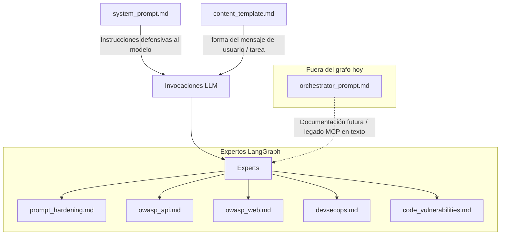

# Guía de Prompts

## Dónde están los prompts

Los prompts están empaquetados con el código en:

```
src/agent/src/code_analysis/prompts/
```

## Modificar un prompt existente

1. Edita el archivo `.md` correspondiente:
   ```bash
   vim src/agent/src/code_analysis/prompts/experts/owasp_api.md
   ```

2. Rebuild de la imagen del agente (desde raíz del monorepo):

   ```bash
   docker build -f src/agent/Dockerfile -t titvo-agent:latest src/agent
   ```

## Jerarquía de prompts



- **`system_prompt.md`** y **`content_template.md`** siguen aplicándose al armar mensajes conforme tu caso de uso.
- **`orchestrator_prompt.md`** existe y se puede leer desde `PromptRegistry`; **la orquestación MCP en LangGraph no delega la secuencia al LLM** (está en `MCPRetrievalNode`).

## Prompts de expertos

| Experto | Archivo | Foco |
|---------|---------|------|
| prompt_hardening | `experts/prompt_hardening.md` | Detectar payloads de prompt injection |
| owasp_api | `experts/owasp_api.md` | OWASP API Top 10 |
| owasp_web | `experts/owasp_web.md` | OWASP Web Top 10 |
| devsecops | `experts/devsecops.md` | CI/CD, IaC, containers |
| code_vulnerabilities | `experts/code_vulnerabilities.md` | Vulns de lenguaje |

## Cargar prompts en código

```python
from code_analysis import prompts

# Prompt base
system_prompt = prompts.get_system_prompt()

# Template para formatear mensajes
content_template = prompts.get_content_template()

# Prompt de experto específico
expert_prompt = prompts.get_expert_prompt("owasp_api")
```

## Variables disponibles

En `content_template.md`:
- `{repository_url}` — URL del repositorio
- `{commit_hash}` — Hash del commit
- `{args}` — Parámetros adicionales
- `{files_content}` — Bloque opcional para incluir contenido formateado (en algunos caminos puede dejarse vacío y rellenarse en iteraciones siguientes si el caso de uso lo requiere)

## Reglas de severidad (compartidas)

**CRITICAL/HIGH:**
- Vulnerabilidad confirmada y explotable
- Evidencia concreta en el código
- Ejemplos: backdoors, credenciales hardcodeadas, SQLi directo

**MEDIUM:**
- Probablemente vulnerable pero falta contexto
- Depende de configuración externa

**LOW:**
- Issues menores
- Versiones desactualizadas sin CVE confirmado

## Idioma

Todos los prompts producen output en **español neutro**:
- `description`
- `summary`
- `recommendation`
