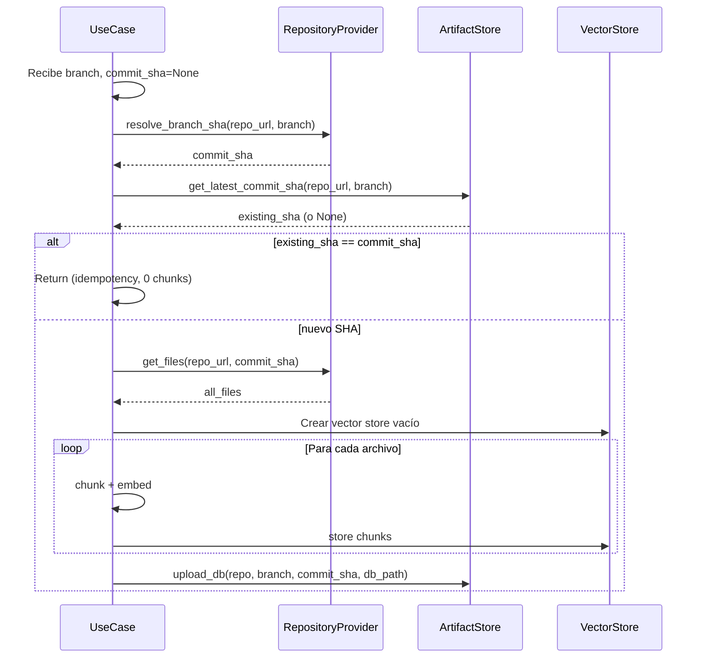
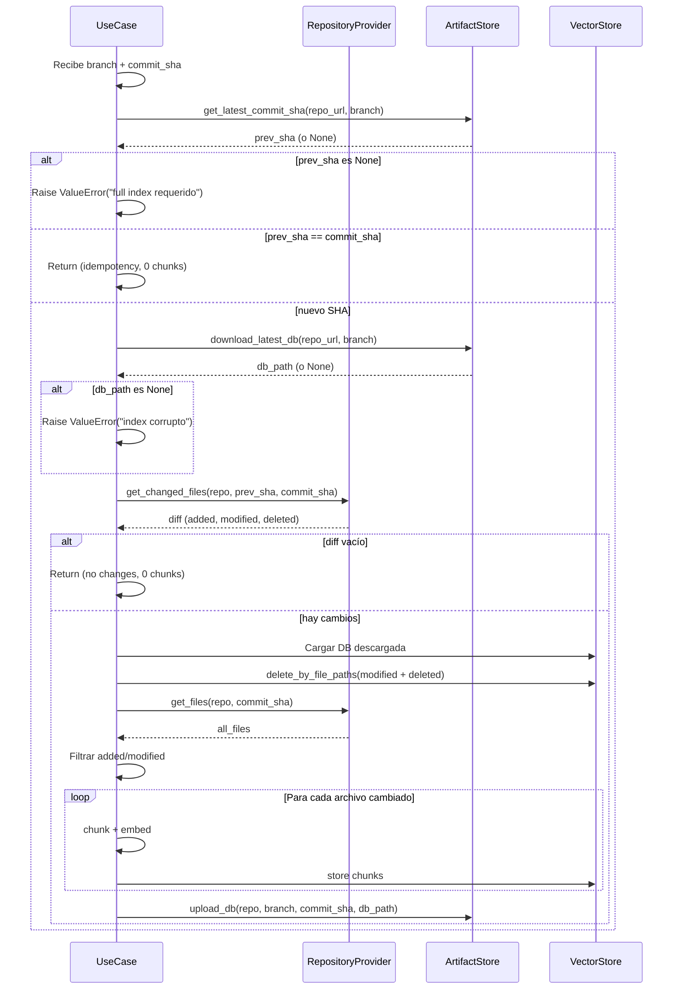

# RAG Indexer

Servicio de indexación de repositorios para RAG (Retrieval-Augmented Generation). Genera embeddings del código fuente y los persiste en SQLite con extensión vectorial (sqlite-vec) almacenado en S3.

## Quick Start

```bash
cd src/rag-indexer

# Modo full index (primera vez, por rama)
TITVO_REPO_URL=https://github.com/org/repo \
TITVO_BRANCH=main \
python -m src.main

# Modo delta index (commits posteriores, requiere branch + SHA)
TITVO_REPO_URL=https://github.com/org/repo \
TITVO_BRANCH=main \
TITVO_COMMIT_SHA=abc123 \
python -m src.main
```

## Arquitectura

```mermaid
flowchart TD
    Input[TITVO_REPO_URL + TITVO_BRANCH + opcional TITVO_COMMIT_SHA] --> CheckBranch{¿TITVO_BRANCH?}
    CheckBranch -->|No| ErrorBranch[Error: branch requerido]
    CheckBranch -->|Sí| CheckSha{¿TITVO_COMMIT_SHA?}

    CheckSha -->|No| Full[Full Index]
    CheckSha -->|Sí| Delta[Delta Index]

    Full --> Resolve[Resolver HEAD SHA via API]
    Resolve --> GetAll[Obtener todos los archivos vía REST API]

    Delta --> CheckLatest[Leer branches/{branch}/latest/meta.json]
    CheckLatest -->|No existe| ErrorDelta[Error: full index requerido]
    CheckLatest -->|Existe| DownloadDB[Descargar branches/{branch}/latest/index.db]
    DownloadDB --> Diff[Calcular diff vía API]
    Diff --> GetChanged[Obtener solo archivos cambiados]

    GetAll --> Chunk[LangChain Chunking]
    GetChanged --> Chunk

    Chunk --> Embed[Generar embeddings]
    Embed --> Store[SQLite + sqlite-vec]
    Store --> Upload[Subir a S3: branches/{branch}/{sha}/ y latest/]
```

## Estructura S3

```
s3://<bucket>/
├── github.com/org/repo/
│   └── branches/
│       └── {branch}/
│           ├── {commit_sha}/
│           │   ├── index.db       ← Base de datos SQLite con vectores
│           │   └── meta.json      ← {"commit_sha": "...", "indexed_at": "..."}
│           └── latest/
│               ├── index.db       ← Copia del commit más reciente
│               └── meta.json      ← Puntero al último commit indexado
```

## Variables de entorno

| Variable | Requerida | Descripción |
|----------|-----------|-------------|
| TITVO_REPO_URL | Sí | URL del repositorio (GitHub o Bitbucket) |
| TITVO_BRANCH | Sí | Rama para full/delta index |
| TITVO_COMMIT_SHA | No | SHA para delta index (solo para delta) |
| TITVO_DYNAMO_CONFIGURATION_TABLE_NAME | Sí | Tabla DynamoDB de configuración |
| TITVO_ENCRYPTION_KEY_NAME | Sí | Clave KMS para secretos |
| TITVO_CHUNK_SIZE | No | Tamaño de chunk (default: 1000) |
| TITVO_CHUNK_OVERLAP | No | Overlap de chunks (default: 200) |
| TITVO_LOG_LEVEL | No | Nivel de log (default: INFO) |

**Combinaciones válidas:**
- `TITVO_BRANCH` solo → Full index (resuelve HEAD de la rama)
- `TITVO_BRANCH` + `TITVO_COMMIT_SHA` → Delta index (compara con índice de la rama)
- `TITVO_COMMIT_SHA` solo → **Error**: branch es siempre requerido

## Configuración DynamoDB

| Parámetro | Descripción |
|-----------|-------------|
| rag_index_bucket | Bucket S3 para los índices |
| embedding_model | Modelo de embeddings (ej: text-embedding-3-small) |
| embedding_provider | Proveedor (openai) |
| embedding_api_key | API key para embeddings (encriptado; en local mismo valor que `ai_api_key` vía `IA_API_KEY`) |
| github_access_token | Token GitHub API |
| bitbucket_api_token | Token Bitbucket API |

## Modos de operación

### Full Index

Usar cuando no existe índice previo para la rama.

**Flujo:**


**Ejemplo:**
```bash
TITVO_REPO_URL=https://github.com/KaribuLab/titvo \
TITVO_BRANCH=main \
TITVO_DYNAMO_CONFIGURATION_TABLE_NAME=titvo-config \
TITVO_ENCRYPTION_KEY_NAME=titvo-key \
python -m src.main
```

### Delta Index

Usar para commits subsiguientes cuando ya existe un índice previo para la rama.

**Flujo:**


**Ejemplo:**
```bash
TITVO_REPO_URL=https://github.com/KaribuLab/titvo \
TITVO_BRANCH=main \
TITVO_COMMIT_SHA=a1b2c3d \
TITVO_DYNAMO_CONFIGURATION_TABLE_NAME=titvo-config \
TITVO_ENCRYPTION_KEY_NAME=titvo-key \
python -m src.main
```

## API REST utilizadas

### GitHub
- `GET /repos/{owner}/{repo}/git/ref/heads/{branch}` - Resolver SHA de rama
- `GET /repos/{owner}/{repo}/git/trees/{sha}?recursive=1` - Árbol de archivos
- `GET /repos/{owner}/{repo}/contents/{path}` - Contenido de archivo
- `GET /repos/{owner}/{repo}/compare/{base}...{head}` - Diff entre commits

### Bitbucket
- `GET /repositories/{workspace}/{slug}/refs/branches/{branch}` - Resolver SHA
- `GET /repositories/{workspace}/{slug}/src/{sha}/` - Árbol de archivos (paginado)
- `GET /repositories/{workspace}/{slug}/src/{sha}/{path}` - Contenido de archivo
- `GET /repositories/{workspace}/{slug}/diffstat/{old}..{new}` - Diff (paginado)

## Filtrado de archivos

Se excluyen automáticamente:
- Directorios: `node_modules/`, `.git/`, `__pycache__/`, `.venv/`, `venv/`, etc.
- Extensiones binarias: `.exe`, `.dll`, `.so`, `.jpg`, `.png`, `.zip`, etc.
- Bases de datos: `.db`, `.sqlite`, `.sqlite3`

## Dependencias

```toml
[dependencies]
httpx = ">=0.28.0"
langchain = ">=0.3.0"
langchain-community = ">=0.3.0"
langchain-openai = ">=0.3.0"
sqlite-vec = ">=0.1.0"
boto3 = ">=1.40.59"
```

## Troubleshooting

### "Unsupported repository provider"

- Solo soporta GitHub (`github.com`) y Bitbucket (`bitbucket.org`)
- Verificar que la URL incluya el host correcto

### "Could not resolve branch"

- Verificar que el token tenga permisos de lectura (`repo` para GitHub)
- Verificar que la rama exista en el remoto
- Verificar formato de URL: `https://github.com/owner/repo`

### "No previous index found" en modo delta

- **Error explícito** (no hay fallback automático)
- Ejecutar primero full index con `TITVO_BRANCH`
- Luego ejecutar delta con `TITVO_BRANCH` + `TITVO_COMMIT_SHA`

### "Rate limit exceeded"

- Implementado retry con backoff exponencial en adaptadores
- Para repos grandes, la API puede requerir varias páginas (paginación automática)

### Error cargando sqlite-vec

```python
import sqlite3
import sqlite_vec

conn = sqlite3.connect("index.db")
conn.enable_load_extension(True)
sqlite_vec.load(conn)  # Requiere sqlite-vec instalado
conn.enable_load_extension(False)
```

Si falla, verificar:
- `pip install sqlite-vec`
- Python 3.13 compatible
- No requiere dependencias de sistema adicionales en Alpine

### Diff vacío sin cambios

- El sistema detecta automáticamente cuando no hay cambios
- Termina sin modificar el índice y registra log INFO

## Rebuild después de cambios

```bash
# Desde la raíz del monorepo
docker build -f src/rag-indexer/Dockerfile -t titvo-rag-indexer:latest src/rag-indexer
```

## Tests unitarios

```bash
cd src/rag-indexer
.venv/bin/python -m pytest tests/unit/ -v
```

## Integración futura con src/agent

El diseño prepara `IVectorStorePort.search()` para ser consumido por el agente:

```python
# Pseudocódigo de integración futura
vector_store = SqliteVecStoreAdapter(
    db_path=download_latest_db(repo_url),
    embedding_provider=embedding_provider,
    ...
)
results = vector_store.search("SQL injection vulnerability", k=5)
```

El cambio `agent-rag-integration` implementará esta conexión.
