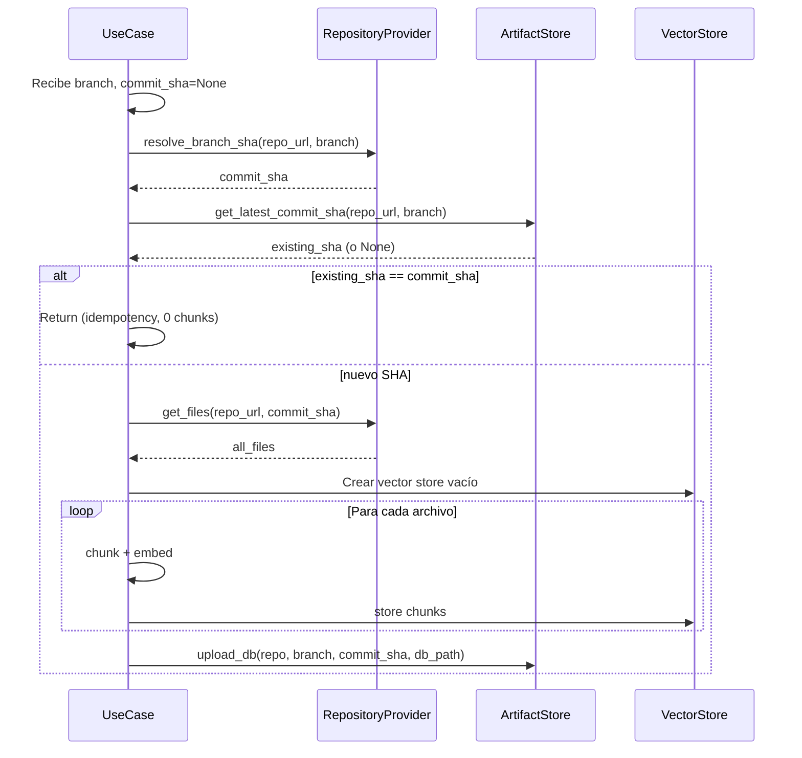
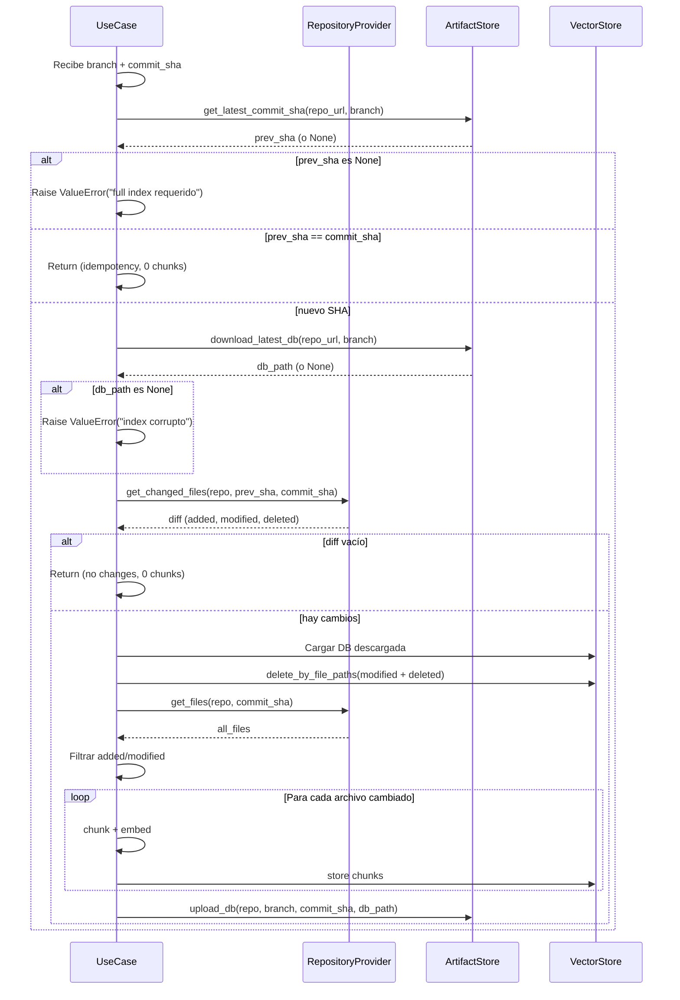

# RAG Indexer

Servicio de indexación de repositorios para RAG (Retrieval-Augmented Generation). Genera embeddings del código fuente y los persiste en SQLite con extensión vectorial (sqlite-vec) almacenado en S3.

## Quick Start

```bash
cd src/rag-indexer

# Modo full index (primera vez, por rama)
TITVO_REPO_URL=https://github.com/org/repo \
TITVO_BRANCH=main \
python -m src.main

# Modo delta index (commits posteriores, requiere branch + SHA)
TITVO_REPO_URL=https://github.com/org/repo \
TITVO_BRANCH=main \
TITVO_COMMIT_SHA=abc123 \
python -m src.main
```

## Arquitectura

```mermaid
flowchart TD
    Input[TITVO_REPO_URL + TITVO_BRANCH + opcional TITVO_COMMIT_SHA] --> CheckBranch{¿TITVO_BRANCH?}
    CheckBranch -->|No| ErrorBranch[Error: branch requerido]
    CheckBranch -->|Sí| CheckSha{¿TITVO_COMMIT_SHA?}

    CheckSha -->|No| Full[Full Index]
    CheckSha -->|Sí| Delta[Delta Index]

    Full --> Resolve[Resolver HEAD SHA vía Git SSH]
    Resolve --> GetAll[Obtener blobs del commit vía Git SSH]

    Delta --> CheckLatest[Leer branches/{branch}/latest/meta.json]
    CheckLatest -->|No existe| ErrorDelta[Error: full index requerido]
    CheckLatest -->|Existe| DownloadDB[Descargar branches/{branch}/latest/index.db]
    DownloadDB --> Diff[Traer ambos commits y calcular git diff]
    Diff --> GetChanged[Leer blobs añadidos o modificados]

    GetAll --> Chunk[LangChain Chunking]
    GetChanged --> Chunk

    Chunk --> Embed[Generar embeddings]
    Embed --> Store[SQLite + sqlite-vec]
    Store --> Upload[Subir a S3: branches/{branch}/{sha}/ y latest/]
```

## Estructura S3

```
s3://<bucket>/
├── github.com/org/repo/
│   └── branches/
│       └── {branch}/
│           ├── {commit_sha}/
│           │   ├── index.db       ← Base de datos SQLite con vectores
│           │   └── meta.json      ← {"commit_sha": "...", "indexed_at": "..."}
│           └── latest/
│               ├── index.db       ← Copia del commit más reciente
│               └── meta.json      ← Puntero al último commit indexado
```

## Variables de entorno

| Variable | Requerida | Descripción |
|----------|-----------|-------------|
| TITVO_REPO_URL | Sí | URL del repositorio (GitHub o Bitbucket) |
| TITVO_BRANCH | Sí | Rama para full/delta index |
| TITVO_COMMIT_SHA | No | SHA para delta index (solo para delta) |
| TITVO_DYNAMO_CONFIGURATION_TABLE_NAME | Sí | Tabla DynamoDB de configuración |
| TITVO_ENCRYPTION_KEY_NAME | Sí | Clave KMS para secretos |
| TITVO_CHUNK_SIZE | No | Tamaño de chunk (default: 1000) |
| TITVO_CHUNK_OVERLAP | No | Overlap de chunks (default: 200) |
| TITVO_LOG_LEVEL | No | Nivel de log (default: INFO) |

**Combinaciones válidas:**
- `TITVO_BRANCH` solo → Full index (resuelve HEAD de la rama)
- `TITVO_BRANCH` + `TITVO_COMMIT_SHA` → Delta index (compara con índice de la rama)
- `TITVO_COMMIT_SHA` solo → **Error**: branch es siempre requerido

## Configuración DynamoDB

| Parámetro | Descripción |
|-----------|-------------|
| rag_index_bucket | Bucket S3 para los índices |
| embedding_model | Modelo de embeddings (ej: text-embedding-3-small) |
| embedding_provider | Proveedor (openai) |
| embedding_api_key | API key para embeddings (encriptado; en local mismo valor que `ai_api_key` vía `IA_API_KEY`) |
| github_ssh_private_key | Llave privada SSH de solo lectura para GitHub (encriptada) |
| bitbucket_ssh_private_key | Llave privada SSH de solo lectura para Bitbucket (encriptada) |

El indexador desencripta únicamente la llave correspondiente al host del repositorio. Las llaves deben
estar autorizadas para lectura, no requerir passphrase y conservar saltos de línea PEM reales.

## Modos de operación

El agente usa el RAG index como contexto de fondo para correlación, dependencias y arquitectura; no es
la fuente primaria de archivos analizados. Los archivos primarios siempre vienen del MCP
`git.commit-files` en modo `commit` o `full`.

Para `scan_mode=full`, el agente prioriza exactitud sobre velocidad: antes de ejecutar LangGraph,
verifica que el commit/ref objetivo esté indexado con `is_commit_indexed(repo, branch, commit_sha)`.
Si no lo está, dispara indexación y espera a que termine para evitar contexto stale.

### Full Index

Usar cuando no existe índice previo para la rama.

**Flujo:**

```mermaid
sequenceDiagram
    participant U as UseCase
    participant RP as RepositoryProvider
    participant AS as ArtifactStore
    participant VS as VectorStore

    U->>U: Recibe branch, commit_sha=None
    U->>RP: resolve_branch_sha(repo_url, branch)
    RP-->>U: commit_sha
    U->>AS: get_latest_commit_sha(repo_url, branch)
    AS-->>U: existing_sha (o None)
    alt existing_sha == commit_sha
        U->>U: Return (idempotency, 0 chunks)
    else nuevo SHA
        U->>RP: get_files(repo_url, commit_sha)
        RP-->>U: all_files
        U->>VS: Crear vector store vacío
        loop Para cada archivo
            U->>U: chunk + embed
            U->>VS: store chunks
        end
        U->>AS: upload_db(repo, branch, commit_sha, db_path)
    end
```

**Ejemplo:**
```bash
TITVO_REPO_URL=https://github.com/KaribuLab/titvo \
TITVO_BRANCH=main \
TITVO_DYNAMO_CONFIGURATION_TABLE_NAME=titvo-config \
TITVO_ENCRYPTION_KEY_NAME=titvo-key \
python -m src.main
```

### Delta Index

Usar para commits subsiguientes cuando ya existe un índice previo para la rama.

**Flujo:**

```mermaid
sequenceDiagram
    participant U as UseCase
    participant RP as RepositoryProvider
    participant AS as ArtifactStore
    participant VS as VectorStore

    U->>U: Recibe branch + commit_sha
    U->>AS: get_latest_commit_sha(repo_url, branch)
    AS-->>U: prev_sha (o None)
    alt prev_sha es None
        U->>U: Raise ValueError("full index requerido")
    else prev_sha == commit_sha
        U->>U: Return (idempotency, 0 chunks)
    else nuevo SHA
        U->>AS: download_latest_db(repo_url, branch)
        AS-->>U: db_path (o None)
        alt db_path es None
            U->>U: Raise ValueError("index corrupto")
        end
        U->>RP: get_changed_files(repo, prev_sha, commit_sha)
        RP-->>U: diff (added, modified, deleted)
        alt diff vacío
            U->>U: Return (no changes, 0 chunks)
        else hay cambios
            U->>VS: Cargar DB descargada
            U->>VS: delete_by_file_paths(modified + deleted)
            U->>RP: get_files(repo, commit_sha)
            RP-->>U: all_files
            U->>U: Filtrar added/modified
            loop Para cada archivo cambiado
                U->>U: chunk + embed
                U->>VS: store chunks
            end
            U->>AS: upload_db(repo, branch, commit_sha, db_path)
        end
    end
```

**Ejemplo:**
```bash
TITVO_REPO_URL=https://github.com/KaribuLab/titvo \
TITVO_BRANCH=main \
TITVO_COMMIT_SHA=a1b2c3d \
TITVO_DYNAMO_CONFIGURATION_TABLE_NAME=titvo-config \
TITVO_ENCRYPTION_KEY_NAME=titvo-key \
python -m src.main
```

## Obtención de fuentes por Git SSH

GitHub y Bitbucket usan el mismo adaptador y siempre se normalizan a un remoto SSH:

- `git ls-remote --heads` resuelve el SHA exacto de la rama.
- `git init` crea un repositorio temporal sin working tree.
- `git fetch --depth=1` trae únicamente el commit requerido; delta trae el SHA previo y el objetivo.
- `git ls-tree` y `git cat-file` enumeran y leen blobs sin seguir symlinks del filesystem.
- `git diff --name-status -z -M` clasifica añadidos, modificados, eliminados y renames.

No existen adaptadores ni fallback de obtención por API. Cualquier fallo SSH termina el job con error.
La identidad de `github.com` y `bitbucket.org` se verifica con host keys versionadas en la imagen.

## Filtrado de archivos

Se excluyen automáticamente:
- Directorios: `node_modules/`, `.git/`, `__pycache__/`, `.venv/`, `venv/`, etc.
- Extensiones binarias: `.exe`, `.dll`, `.so`, `.jpg`, `.png`, `.zip`, etc.
- Bases de datos: `.db`, `.sqlite`, `.sqlite3`

## Dependencias

```toml
[dependencies]
langchain = ">=0.3.0"
langchain-community = ">=0.3.0"
langchain-openai = ">=0.3.0"
sqlite-vec = ">=0.1.0"
boto3 = ">=1.40.59"
```

La imagen instala además `git` y `openssh-client` como dependencias del sistema.

## Troubleshooting

### "Unsupported repository provider"

- Solo soporta GitHub (`github.com`) y Bitbucket (`bitbucket.org`)
- Verificar que la URL incluya el host correcto

### "Could not resolve branch"

- Verificar que la llave SSH del proveedor tenga acceso de lectura al repositorio
- Verificar que la rama exista en el remoto
- Verificar formato de URL: `https://github.com/owner/repo` o `git@github.com:owner/repo.git`
- Verificar que el parámetro cifrado sea `github_ssh_private_key` o `bitbucket_ssh_private_key`

### "No previous index found" en modo delta

- **Error explícito** (no hay fallback automático)
- Ejecutar primero full index con `TITVO_BRANCH`
- Luego ejecutar delta con `TITVO_BRANCH` + `TITVO_COMMIT_SHA`

### Error de autenticación o host key SSH

- Verificar que la llave no requiera passphrase y conserve formato PEM válido
- Verificar que la llave pública asociada esté autorizada como deploy/access key de solo lectura
- No usar `ssh-keyscan` ni desactivar `StrictHostKeyChecking`; las host keys están fijadas en la imagen

### Error cargando sqlite-vec

```python
import sqlite3
import sqlite_vec

conn = sqlite3.connect("index.db")
conn.enable_load_extension(True)
sqlite_vec.load(conn)  # Requiere sqlite-vec instalado
conn.enable_load_extension(False)
```

Si falla, verificar:
- `pip install sqlite-vec`
- Python 3.13 compatible
- No requiere dependencias de sistema adicionales en Alpine

### Diff vacío sin cambios

- El sistema detecta automáticamente cuando no hay cambios
- Termina sin modificar el índice y registra log INFO

## Rebuild después de cambios

```bash
# Desde la raíz del monorepo
docker build -f src/rag-indexer/Dockerfile -t titvo-rag-indexer:latest src/rag-indexer
```

## Despliegue a AWS

El despliegue se automatiza con `.github/workflows/deploy-to-aws.yml` (push a `main` en el repo
`KaribuLab/titvo-rag-indexer`). A diferencia de otros servicios, autentica por **OIDC** mediante
`aws-actions/configure-aws-credentials` con `role-to-assume`, sin credenciales estáticas.

### Prerequisitos

- Rol IAM OIDC que GitHub pueda asumir, con permisos de deploy sobre `aws/*` (ECR, Batch, SSM, IAM).
  Se referencia vía el secret `AWS_TITVO_BATCH_ROLE_TO_ASSUME`.
- Secretos del repo: `AWS_TITVO_BATCH_ROLE_TO_ASSUME` (ARN del rol) y `AWS_TITVO_ACCOUNT_ID`.

### Flujo

1. Gates locales: `uv run ruff check .` y `uv run pytest`.
2. `terragrunt apply` sobre `aws/ecr` con credenciales OIDC.
3. Build y push de la imagen a ECR.
4. Push con tag `:latest` además del tag por SHA: AWS Batch resuelve la job definition contra
   `${ecr_repository_url}:latest` (módulo `terraform-aws-batch`).
5. `terragrunt run-all apply` sobre `aws/` (batch y SSM upsert/lookup).

Variables del workflow: `AWS_REGION=us-east-2`, `AWS_STAGE=prod`,
`ECR_REPOSITORY=tvo-rag-indexer-ecr-prod`, `IMAGE_TAG=github.sha`. El resto viaja por
`serverless.hcl` (`get_env` de `AWS_REGION`/`AWS_STAGE`/`AWS_ACCOUNT_ID`).

Reproducción manual local:

```bash
cd src/rag-indexer/aws
AWS_REGION=us-east-2 AWS_STAGE=prod AWS_ACCOUNT_ID=<id> terragrunt run-all apply
```

## Tests unitarios

```bash
cd src/rag-indexer
.venv/bin/python -m pytest tests/unit/ -v
```

## Consumo del index.db por el agente

El agente (`src/agent`) utiliza activamente el `index.db` generado por el rag-indexer durante cada
análisis de seguridad. El flujo es:

### 1. Descarga desde S3

`S3SqliteRagContextAdapter` descarga el archivo `latest/index.db` a un archivo temporal en `/tmp`
al inicio de cada job (el contenedor Batch es efímero, la descarga ocurre una sola vez por ejecución):

```python
# Ruta S3: {repo_path}/branches/{branch}/latest/index.db
adapter = S3SqliteRagContextAdapter(
    s3_client=boto3.client("s3"),
    bucket_name=TITVO_RAG_INDEXER_BUCKET,
    embedding_provider="openai",
    embedding_model="text-embedding-3-small",
    embedding_api_key=api_key,
)
adapter.configure(repository_url, branch)
```

### 2. Búsqueda vectorial en el nodo `rag_retrieve`

Por cada archivo del commit, `RagRetrievalNode` ejecuta una búsqueda vectorial con la misma API de
embeddings usada en la indexación:

```python
# query = "{path}\n{content[:400]}"
chunks = adapter.search(query=f"{file_path}\n{file_content[:400]}", k=3)
# → [{"file_path": "...", "chunk_text": "...", "distance": 0.12}, ...]
```

Los resultados se deduplican por `chunk_text` y se limitan a 30 chunks totales.

### 3. Post-filtrado por experto

Cada nodo experto aplica `should_analyze_file(chunk["file_path"])` sobre los `rag_chunks` del estado.
Esto garantiza que cada experto reciba solo el contexto RAG relevante a su dominio (sin costo de
embeddings adicional):

- `devsecops`: filtra a `.yml`, `Dockerfile`, `.tf`, `.github/**`
- `owasp_api`: filtra a controllers, routes, handlers
- `owasp_web`: filtra a `.html`, `.tsx`, `.vue`, `.js`
- `prompt_hardening`, `code_vulnerabilities`: reciben todos los chunks (sin filtro)

### 4. Entrega al LLM

Los chunks filtrados se incluyen en el human message como bloque `=== RAG CONTEXT ===`:

```
=== FILE: src/auth.ts ===
...contenido del commit...
=== END FILE ===

=== RAG CONTEXT (codebase background) ===
--- src/middleware/auth.ts ---
...chunk del codebase relacionado...
=== END RAG CONTEXT ===
```

### 5. Limpieza

Tras completar la búsqueda, `adapter.close()` elimina el archivo temporal del `index.db`.

### Degradación graceful

En cualquier punto del flujo (S3 no disponible, índice no encontrado, error de embeddings, error
de sqlite-vec), el adaptador retorna `[]` y el análisis continúa solo con los archivos del commit.

## Resiliencia: checkpointing, source snapshot, lock distribuido y resume

Desde el change `add-rag-indexer-resume-checkpointing`, el `rag-indexer` puede sobrevivir a interrupciones del job (OOM, timeout, evict) y coordinar runs concurrentes sobre la misma `(repo, branch)`.

### S3 keys layout

```
{s3}/{repo_host}/{owner}/{repo}/
├── locks/{branch}.json                        # lock distribuido (atomic IfNoneMatch)
├── branches/{branch}/
│   ├── checkpoints/{commit_sha}/
│   │   ├── index.db                            # checkpoint DB en progreso
│   │   └── repo.tar.gz                         # snapshot del .git local
│   └── {commit_sha}/
│       ├── index.db                            # DB final
│       └── meta.json                           # timestamp
└── latest/
    ├── index.db                                # puntero al commit más reciente
    └── meta.json
```

### Ciclo de vida del checkpoint

1. **Run fresh**: no existe `index.db` de checkpoint. Se crea DB local vacío, se hace `git fetch` + `cat-file blob` × N, se sube el primer checkpoint DB a `checkpoints/{commit_sha}/index.db` cuando `processed_count % N == 0`.
2. **Run interrumpido**: el job muere. El DB local efímero desaparece. El siguiente run para el mismo commit:
   - Detecta checkpoint en S3, lo descarga.
   - Detecta snapshot del `.git`, lo restaura.
   - `get_files(exclude_paths=indexed_files)` lee solo los archivos no commiteados.
   - Resume desde el siguiente archivo.
3. **Run exitoso**: tras `upload_db`, el checkpoint + snapshot se eliminan.

### Lock distribuido

- **Adquisición**: `PutObject` con `IfNoneMatch="*"` en `locks/{branch}.json`. **Atómico** — si otro job ya tiene el lock, retorna `False`.
- **Cuerpo del lock**: `owner`, `aws_batch_job_id`, `acquired_at`, `expires_at`, `commit_sha`.
- **TTL**: 360 minutos (default). Renovación cada 30 min con `IfMatch` (no pisa lock ajeno).
- **Fail-fast**: si el lock está activo, el job falla con `RuntimeError` ANTES de invocar `embed()`. Costo OpenAI de un job "perdedor": $0.
- **Stale lock takeover**: si `expires_at < now`, el job toma el lock (con `IfNoneMatch="*"` retry).
- **Defense in depth**: antes de embeber un archivo, `_process_files` consulta `is_file_indexed(file.path)`. Si otro job ya lo commiteó, lo skipea.

### Política de uso desde el `src/agent`

El lock S3 es la fuente de verdad para "job corriendo". El `src/agent` debería (futuro change) implementar `IRagIndexStatusPort.get_active_lock(repo, branch)` que lee `locks/{branch}.json`. Si retorna un lock no expirado, el agente debe esperar al job existente (haciendo polling de `lock.aws_batch_job_id` con `aws_batch.describe_jobs`) en lugar de gatillar uno nuevo. Esto garantiza que múltiples análisis concurrentes produzcan la misma calidad (operan sobre el mismo RAG index final).

### Métrica `files_skipped_resume`

El `IndexResultDto` incluye `files_skipped_resume: int` que reporta cuántos archivos se omitieron en un run de resume (ya estaban en `indexed_files`). Útil para saber cuánto progreso se preservó tras una interrupción.

### Batching explícito + streaming

- `LangChainEmbeddingAdapter.embed(texts)` particiona en bloques de `TITVO_EMBEDDING_BATCH_SIZE` (default 1000) y emite logs `INFO Embedded batch i/N chunks=N duration_ms=Y` por bloque.
- `LangChainEmbeddingAdapter.embed_iter(texts_iter)` itera chunks uno a uno, batcheando on-the-fly. Permite streaming chunk-by-chunk.
- `LangChainCodeSplitter.iter_chunks(file)` y `_process_files` cooperan para que por cada chunk se haga `insert_one` + `embedding_provider.embed_iter()` sin acumular listas en memoria.
- Memoria pico del bloque: ~10 KB (1 chunk + 1 embedding) vs ~6 MB con listas pre-batched.

